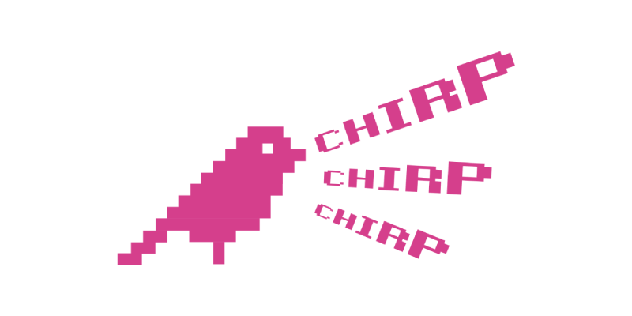

# Chirper

A simple chat application that uses the [DAT p2p protocol.](https://dat.foundation/) Built for my talk _“It’s Time to Reinvent the Web, Without the Internet”_ at the [Heapcon 2019](https://heapcon.io) conference in Belgrade.

You can access Chirper using the Beaker Browser and entering this Dat URL: [dat://chirper.hashbase.io/](dat://chirper.hashbase.io/)

It might be a bit lonely so follow my public key to get started: `dat://0706ddb361021423dfc1c75e8fd622b02ab7f4606ecad54a8cece2b3e5eb15a6`

Btw, send me your public key in a DM on twitter over at [@DanicFilip](https://twitter.com/DanicFilip)

## Slides and Presentation

The slides for my talk are up on [dat://dat-heapcon2019.hashbase.io/](dat://dat-heapcon2019.hashbase.io/), but they aren’t that interesting. What’s interesting is that I built my own lightweight presentation framework for this use case with React. [Check it out.](https://github.com/filipdanic/heapcon-2019-slides)

_Video will be published soon._

## With Thanks To

- @aaronshaf’s [datchat](https://github.com/aaronshaf/datchat) prototype.
- @cabel-club’s impressive [group chat app.](https://github.com/cabal-club)
- @segunadebayo’s awesome [chakra-ui](https://github.com/chakra-ui/chakra-ui) component library.
- André Staltz for being an endless source of inspiration in the p2p movement.
